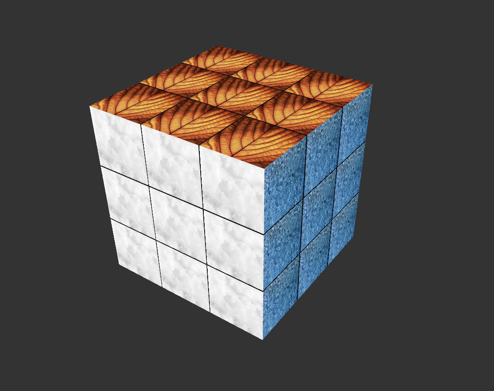
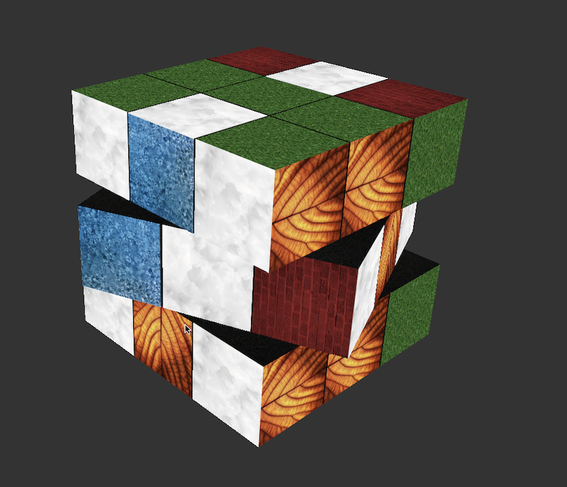
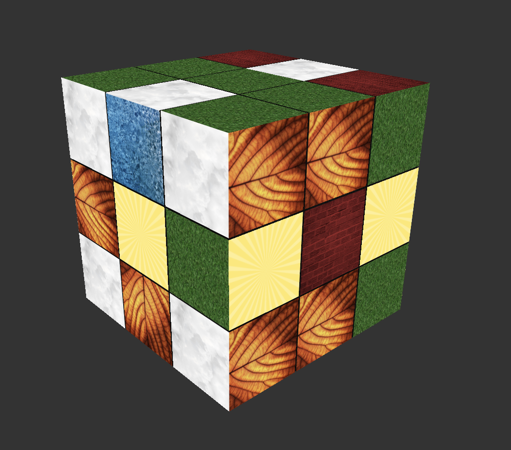

## Earthy Rubik's Cube
## YouTube Link: https://youtu.be/U51UdoI9yCA
## Screenshots

* Name and partners name(At most teams of 2 folks total)
  * Team member 1: John Ciolfi
* How many hours did it take you to complete this final project? ~25
* Did you collaborate or share ideas with any other students/TAs/Professors? TAs about index management, shaders.
* Did you use any external resources? 
  * Note it is fair to utilize some tutorials--cite them here. You **must** add your own personal touch however!
  * [Cube Indices Logic](https://en.wikibooks.org/wiki/OpenGL_Programming/Modern_OpenGL_Tutorial_05)
  * [Blender UV Unwrapping](https://www.educba.com/uv-unwrapping-in-blender/)
  * [Camera Improvements](https://learnopengl.com/Getting-started/Camera) - My camera moves horizontally/vertically based on view direction.
  * [Lighting](https://learnopengl.com/Lighting/Basic-Lighting)
  * [.obj Formatting](http://paulbourke.net/dataformats/obj/)
  * [Shaders](https://learnopengl.com/Getting-started/Shaders)
  * [Roll, Pitch, & Yaw](https://www.linearmotiontips.com/motion-basics-how-to-define-roll-pitch-and-yaw-for-linear-systems/)
  * [Rotating Around Global Axis](https://stackoverflow.com/questions/68779716/opengl-rotate-around-global-axis-using-glmrotate)
  * (Optional) What was the most interesting part of the Final Assignment? How could the instructor improve the final project?
  I enjoyed the freedom to get to do what I wanted. Having a bit more time between A6 and the final project could have been nice. 

### Controls
* Press ESCAPE to reset the camera.
* Use WASD to move around, R to go up, and F to go down.
* You will travel in the direction you're looking. Use your mouse to look around.
* Use the number keys [1-9] to rotate the cube.
* Press tilde (~) to change the rotation direction.
* Press q to quit.

### Rubric

<table>
  <tbody>
    <tr>
      <th>Points</th>
      <th align="center">Description</th>
    </tr>
    <tr>
      <td>(33.3%) Project Completion</td>
     <td align="left"><ul><li>Does the project compile and run.</li><li>Is it polished without any bugs (No weird visual artifacts).</li><li>Did you make a video?</li><li>Did you add a screenshot of your project to the repository?</li></ul></td>
    </tr>
    <tr>
      <td>(33.3%) Technical</td>
      <td align="left"><ul><li>Was the implementation of the project challenging?</li><li>Even if you followed a tutoral, it should not be trivial, and have some personal touch to it.</li><li>Did you have to organize/process a sufficient amount of data?</li><li>Was it clear you consulted some outside resources that go above and beyond the scope of this class</li></ul></td>
    </tr>
    <tr>
      <td>(33.4%) Creativity</td>
      <td align="left"><ul><li>How visually appealing is the scene?<ul><li>Note: There should be some 'wow' factor--instructors discretion is used here.</li></ul></li><li>How original is the project<ul><li>Again, did you enhance a tutorial and do something unique or just go by the book?</li></ul></li></ul></td>
    </tr>
  </tbody>
</table>
